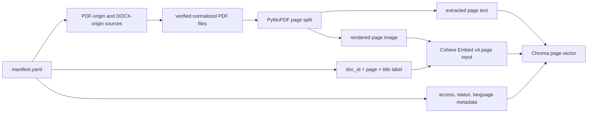

# Architecture

## Position

Defence Agent is an ADK-first controlled evidence workflow over a mixed
English/French normalized page corpus. It has two named agent roles:

- Research Agent: searches approved sources, applies access control before
  retrieval results reach generation, reranks evidence, and produces a cited
  answer from authorized pages.
- Reviewer Agent: checks whether the answer's cited evidence supports the
  claims and returns a citation credibility score.

The answer is always visible in the demo. The reviewer score is the quality
signal used for retry, human review, or pilot go/no-go decisions.

## Runtime

- Google ADK owns the agent loop, sessions, and tool invocation.
- `search_documents` is the only model-facing tool.
- ADK before-tool and after-tool callbacks cache successful search outputs in
  session state for lightweight retry replay.
- Cohere Embed v4 embeds rendered page images with lightweight page labels.
- Chroma stores page vectors, extracted page text, and metadata filters.
- Cohere Rerank v4 orders authorized evidence.
- Cohere Command A is used through ADK/LiteLLM for retrieval orchestration.
- Direct Cohere Chat produces the final grounded answer with native citations.
- The Reviewer Agent reviews citation support only. It does not answer the
  user, search new sources, or act as a truth oracle.
- Local SQLite stores ADK session state only.

## Request Path

1. `session.py` creates or resumes an ADK session with `persona_id`.
2. The ADK agent calls `search_documents`.
3. The before-tool cache callback replays a matching session-scoped result when
   persona, filters, corpus, and model settings match.
4. On cache miss, retrieval embeds the query and applies `access_level`,
   `status`, and `language` filters.
5. A second policy check verifies authorized pages.
6. Rerank orders the remaining evidence.
7. Access failures and no-authorized-source cases are blocked before final
   generation.
8. The after-tool cache callback stores the successful search output in session state.
9. `grounding.py` sends authorized sources to the direct Cohere Chat API. For
   unsupported but authorized evidence gaps, Command A reviews the pages and
   returns an insufficiency refusal instead of inventing facts.
10. The final answer returns with source citations.
11. The Reviewer Agent scores whether cited evidence supports the answer's
    claim spans.
12. `answer_audit` records persona, filters, cache events, source IDs, rerank
    scores, and citation spans for inspection.

## Data Path

The canonical corpus is manifest-driven:

```text
defence_agent/data/corpus/
  manifest.yaml          # document catalog and metadata
  SOURCES.md             # public source provenance
  public/                # vendored official PDFs and DOCX-origin normalized PDFs
  synthetic/             # rendered fictional restricted PDFs
  synthetic_source/      # editable synthetic source text and renderer
```

Current manifest inventory:

| Category | Count | Pages | Access |
|---|---:|---:|---|
| Public official PDF-origin docs | 6 | 187 | `unclassified` |
| Public scanned manual excerpt | 1 | 10 | `unclassified` |
| Public DOCX-origin normalized PDF | 1 | 14 | `unclassified` |
| Synthetic restricted PDFs | 2 | 6 | `secret`, `top_secret` |
| Total | 10 | 217 | mixed |

Language distribution is 121 English pages and 96 French pages.

## Ingestion Flow



The page is the retrieval unit. The prototype does not embed whole documents as
single vectors. It embeds each rendered page image with a small label, then
keeps extracted page text for Chroma results, Rerank, final grounded generation,
citations, and audit metadata.

The retrieval layer is format-agnostic after verified normalization. Native
`.docx` parsing is not implemented here; the corpus includes one DOCX-origin
source represented through the publisher's official PDF pair as a provenance
proof.

## Bilingual Behavior

- English and French source PDFs are separate manifest entries with `language`
  metadata and optional `paired_doc_id` relationships.
- `language="any"` is the default for doctrine questions.
- `language="fr"` and `language="en"` are explicit filters only when the user
  asks for a source language.
- Cross-language citations preserve source-language excerpts.
- Live Cohere Embed v4 and Rerank v4 runs are required before claiming
  multilingual retrieval quality.

Retired legacy architecture notes live outside this main repo at
`/Users/hananather/Desktop/Cohere-legacy-archive`.

Other document files can be normalized to PDF before indexing or added as future
manifest-compatible loaders. That keeps the demo focused on Cohere Embed v4's
mixed text/image retrieval path without implying native DOCX parsing is already
implemented.
